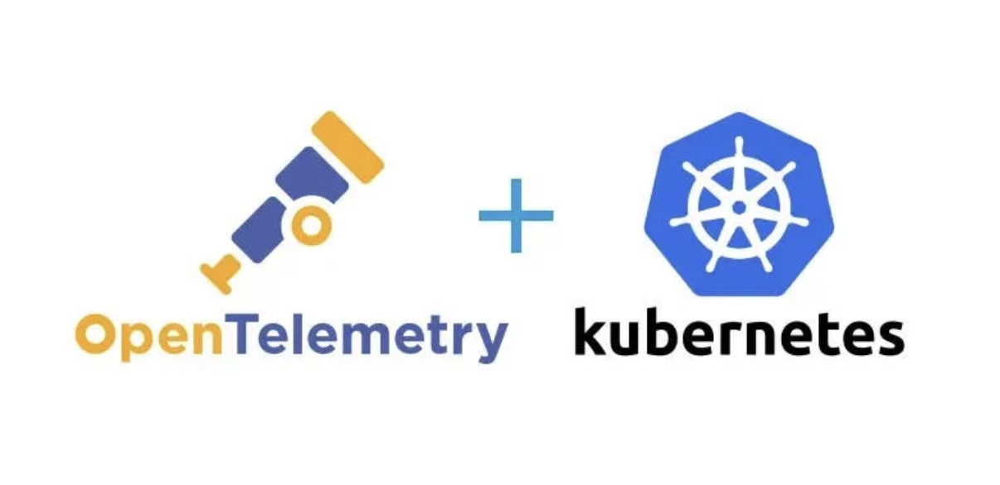
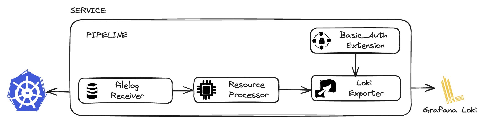
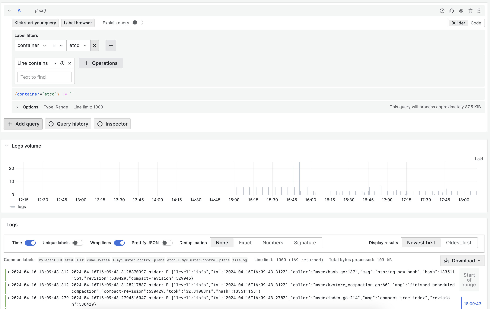

Technical Knowledge article

#  My Tips and Tricks for leveraging OpenTelemetry with a LGM stack to securely gather K8S telemetry Data
#  (2/3) Kubernetes Logs Collection



## Introduction
I implemented OpenTelemetry to collect events, logs, and metrics from a Kubernetes cluster, where previously I used tools like node-exporter, kube-stats-metrics, and promtail with the Loki/Grafana/Mimir suite.

Here, I share some implementation and security tips about Kubernetes Logs Collection and OpenTelemetry.


## Prerequisite
 - A functional Kubernetes cluster with cert-manager installed
 - The LGM suite configured with 2 data sources:
    - https://loki.172.18.1.1.nip.io
    - https://mimir.172.18.1.1.nip.io
 - You have read article :  (1/3) Kubernetes Events Collection , and you already know our tips :

       - Tip 1 - Using the OpenTelemetry-operator
       - Tip 2 - Implementing one collector per type of data
       - Tip 4 - Secret and Env
       - Tip 5 - The Deployment Mode for the Collector

## Tip 7 : No RBAC for logs but specific Volume Mount

Discovering logs and sending them to Loki does not require specific RBAC configurations to be added to our cluster. However, it's worth noting that each container's logs are written to the path /var/log/pods on each node of our cluster. To enable the collector to read these paths, we need to declare a hostpath volume and mount it in the collector pods.

```
  spec:
  env:  ...
  volumes:
    - name: varlogpods
      hostPath:
        path: /var/log/pods
  volumeMounts:
    - name: varlogpods
      mountPath: /var/log/pods
      readOnly: true
```

## Tip 8 :  DaemontSet Mode and Node Taint 

Every node requires a collector to retrieve the log files, thus we will opt for deploying the collector in DaemonSet mode. 


However, it's important to note its a common  practise that control plane nodes have a specific taint to prevent workload applications from being deployed on them. To ensure deployment on the control plane node, we will need to apply a Toleration that matches the Node Taint.

```
  spec:
  env:  ...
  volumes: ...
  volumeMounts:...
  tolerations:
    - operator: Exists
      effect: NoExecute
    - operator: Exists
      effect: NoSchedule
```

###  Tip 9 : Log Config

We will implement the following configuration for our log-collector :


Let's start with the Receivers block:
```
  ...
  config : |
    receivers:
      filelog:
        include:
          - /var/log/pods/*/*/*.log
        include_file_path: true
        start_at: beginning
        operators:
          # Find out which format is used by kubernetes
          - type: router
            id: get-format
            routes:
              - output: parser-docker
                expr: 'body matches "^\\{"'
              - output: parser-crio
                expr: 'body matches "^[^ Z]+ "'
              - output: parser-containerd
                expr: 'body matches "^[^ Z]+Z"'
          # Parse CRI-O format
          - type: regex_parser
            id: parser-crio
            regex: '^(?P<time>[^ Z]+) (?P<stream>stdout|stderr) (?P<logtag>[^ ]*) ?(?P<log>.*)$'
            output: extract_metadata_from_filepath
            timestamp:
              parse_from: attributes.time
              layout_type: gotime
              layout: '2006-01-02T15:04:05.999999999Z07:00'
          # Parse CRI-Containerd format
          - type: regex_parser
            id: parser-containerd
            regex: '^(?P<time>[^ ^Z]+Z) (?P<stream>stdout|stderr) (?P<logtag>[^ ]*) ?(?P<log>.*)$'
            output: extract_metadata_from_filepath
            timestamp:
              parse_from: attributes.time
              layout: '%Y-%m-%dT%H:%M:%S.%LZ'
          # Parse Docker format
          - type: json_parser
            id: parser-docker
            output: extract_metadata_from_filepath
            timestamp:
              parse_from: attributes.time
              layout: '%Y-%m-%dT%H:%M:%S.%LZ'
          - type: move
            from: attributes.log
            to: body
          # Extract metadata from file path
          - type: regex_parser
            id: extract_metadata_from_filepath
            # Pod UID is not always 36 characters long
            regex: '^.*\/(?P<namespace>[^_]+)_(?P<pod_name>[^_]+)_(?P<uid>[a-f0-9\-]{16,36})\/(?P<container_name>[^\._]+)\/(?P<restart_count>\d+)\.log$'
            parse_from: attributes["log.file.path"]
            cache:
              size: 128 # default maximum amount of Pods per Node is 110
          # Rename attributes
          - type: move
            from: attributes["log.file.path"]
            to: resource["filename"]
          - type: move
            from: attributes.container_name
            to: resource["container"]
          - type: move
            from: attributes.namespace
            to: resource["namespace"]
          - type: move
            from: attributes.pod_name
            to: resource["pod"]
          - type: add
            field: resource["cluster"]
            value: $OPEN_TELEMETRY_COLLECTOR_ORGID
          - type: add
            field: resource["node"]
            value: $K8S_NODE_NAME
  ...
```
It relies on filelog receiver module :
https://github.com/open-telemetry/opentelemetry-collector-contrib/blob/main/receiver/filelogreceiver/README.md

There is much more parameters than the previous k8s_events receiver. Let's dive in, and try to explain them.

The collector needs to know where to pick the logs files, it is do through the include parameters. 
```
        include:
          - /var/log/pods/*/*/*.log
        include_file_path: true
        start_at: beginning

```
We ask the receiver to parse the log file from the beginning *start_at: beginning*. The oldest value will be evicted by loki according its configuration.

*include_file_path: true*  is set to add the filepath as the attribute log.file.path.

Here comes the big part of the receiver config :
```
        operators:
          ...

```
The Filelog receiver use *operators* to handle logs.
The log format depends on the CRI utilized in your cluster: (ContainerD, CRI-O, Docker).
While you likely know which CRI is employed, for the sake of this article and to ensure you select the appropriate parser, we've included all options and let the receiver determine the correct one.
This is achieved through operators such as "router, regex_parser, json_parser".

Additionally, the filelog operators have the capability to manipulate resources, similar to what the processor/resource plugin can accomplish.
Therefore, the collector leverages this functionality to rename, add, and relocate certain attributes within the resource at the receiver stage.

Similar to the K8S_Event-Collector, the Processors section will enable us to enhance the gathered data by incorporating ressources like receiver, pod, namespace, container, cluster, filename, and node. These resources will serve as labels in Loki/Grafana.

```
  ...
  config : |
    receivers: ...
    processors:
      resource/logs:
        attributes:
          - action: insert
            key: loki.format
            value: raw
          - action: insert
            key: receiver
            value: 'filelog'
          - action: insert
            key: loki.resource.labels
            value: receiver,pod, namespace, container, cluster, filename, node
    ...
```

Like the previous article, the Exporters block allows exporting the collected and enriched data to their final destination: Loki . There is no much more to say.
https://github.com/open-telemetry/opentelemetry-collector-contrib/blob/main/exporter/lokiexporter/README.md

```
  ...
  config : |
    receivers: ...
    processors: ...
    exporters:
      loki:
        endpoint: https://loki.172.18.1.1.nip.io/loki/api/v1/push
        headers:
          X-Scope-OrgID: $OPEN_TELEMETRY_COLLECTOR_ORGID
        auth:
          authenticator: basicauth/client
        tls:
          insecure: false
          insecure_skip_verify: true
    ...
```

The Extension block allows us to configure the authentication mechanism for the exporter.
```
  ...
  config : |
    receivers: ...
    processors: ...
    exporters: ...
    extensions:
      basicauth/client:
        client_auth: 
          username: $OPEN_TELEMETRY_COLLECTOR_USERNAME 
          password: $OPEN_TELEMETRY_COLLECTOR_PASSWORD
    ...
```

The implementation of our 4 steps is orchestrated by the Services block.
```
  config : |
    receivers: ...
    processors: ...
    exporters: ...
    extensions: ...
    service:
      extensions: [basicauth/client]
      pipelines:
        logs:
          receivers: [filelog]
          processors: [resource/logs]
          exporters: [loki]
  ```
Here is our complete OpenTelemetry file, you can view it here. It is ready to be deployed.
```
kubectl apply -f  https://raw.githubusercontent.com/seb-835/opentelemetry/main/otel/opentelemetry-log.example.yaml
```

### View the collected data in Loki/Grafana Dashboard

Finaly we can connect to our grafana instance and explore Loki DataSource ... apply a filter and Yes we got our containers logs !!!!



I hope you enjoy this article, so please let me know !!!!

And see you soon for the last one : Kubernetes Metrics Collection (3/3)

