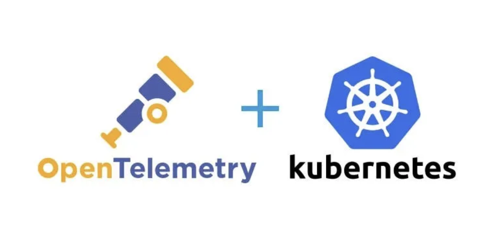

Technical Knowledge article

#  My Tips and Tricks for leveraging OpenTelemetry with a LGM stack to securely gather K8S telemetry Data
#  (3/3) Kubernetes Metrics Collection



## Introduction
I implemented OpenTelemetry to collect events, logs, and metrics from a Kubernetes cluster, where previously I used tools like node-exporter, kube-stats-metrics, and promtail with the Loki/Grafana/Mimir suite.

Here, I share some implementation and security tips about Kubernetes Logs Collection and OpenTelemetry.

## Prerequisite
 - A functional Kubernetes cluster
 - The LGM suite configured with 2 data sources:
    - https://loki.172.18.1.1.nip.io
    - https://mimir.172.18.1.1.nip.io
 - You have read article : (1/3) Kubernetes Events Collection , (2/3) Kubernetes Logs Collection and you already know our tips :

       - Tip 1 - Using the OpenTelemetry-operator
       - Tip 2 - Implementing one collector per type of data
       - Tip 4 - Secret and Env
       - Tip 5 - The Deployment Mode for the Collector
       - Tip 8 - DaemontSet Mode and Node Taint 

## Tip 10 : RBAC to Collect Metrics
To gather Kubernetes Metrics, we will utilize the k8s_cluster and kubeletstats receivers. These receivers will retrieve the relevant values by querying the kubelet and API Server to monitor our cluster. However, they require authorization to perform these actions. Once again, RBAC comes into play, this time with more advanced permissions, necessitating a longer list of resources to access, list, and watch.

We will utilize a dedicated service account for handling metrics. There is no need to grant additional access for the K8S_event service account define earlier.

```
kubectl apply -f  otel/otel_rbac_metrics.yaml
```

###  Tip 11 : Metrics Config

We will implement the following configuration for our metrics-collector :


This time the receivers block will use two receivers.

k8s_cluster : https://github.com/open-telemetry/opentelemetry-collector-contrib/blob/main/receiver/k8sclusterreceiver/README.md

kubeletstats : https://github.com/open-telemetry/opentelemetry-collector-contrib/blob/main/receiver/kubeletstatsreceiver/README.md

The k8s_cluster receiver gathers metrics at the cluster level and captures entity events from the Kubernetes API server, while kubeletstats retrieves data from each kubelet node.

```
  ...
  config : |
    receivers:
      k8s_cluster:
        collection_interval: 10s
        node_conditions_to_report:
          - Ready
          - MemoryPressure
          - DiskPressure
          - NetworkUnavailable
        allocatable_types_to_report:
          - cpu
          - memory
          - storage
          - ephemeral-storage

      kubeletstats:
        collection_interval: 10s
        auth_type: serviceAccount
        endpoint: "${env:K8S_NODE_NAME}:10250"
        insecure_skip_verify: true
        extra_metadata_labels:
        - k8s.volume.type
        k8s_api_config:
          auth_type: serviceAccount
        metric_groups:
        - node
        - pod
        - volume
        - container
  ...
```

The Processors section will enable us to enhance the gathered data by incorporating specifics K8S ressources through the k8sattributes processor. 
The resource processor enables the addition of the cluster name to attributes and the removal of attributes container.id and host.name.

Removing container.id and host.name from metrics is essential. Otherwise, when containers are restarted, it results in the creation of new time series due to the differing labels.

Handling new time series requires additional resources from Mimir and could potentially disrupt certain Grafana dashboard panels, such as rate(containers_restart).

```
  ...
  config : |
    receivers: ...
    processors:
      k8sattributes:
        auth_type: serviceAccount
        passthrough: false
        filter:
          node_from_env_var: K8S_NODE_NAME
        extract:
          metadata:
            - k8s.pod.name
            - k8s.pod.uid
            - k8s.deployment.name
            - k8s.namespace.name
            - k8s.node.name
            - k8s.pod.start_time

      resource:
        attributes:
         - action: delete
           key: container.id
         - key: host.name
           action: delete
         - action: insert
           key: cluster
           value: $OPEN_TELEMETRY_COLLECTOR_ORGID

    ...
```

The prometheusremotewrite exporter is used to transfer the collected and enriched data to their final destination: Mimir.

Enabling resource_to_telemetry_conversion is required to export existing attributes as prometheus/mimir labels.

https://github.com/open-telemetry/opentelemetry-collector-contrib/tree/main/exporter/prometheusremotewriteexporter

```
  ...
  config : |
    receivers: ...
    processors: ...
    exporters:
      prometheusremotewrite:
        endpoint: https://mimir.172.18.1.1.nip.io/api/v1/push
        resource_to_telemetry_conversion:
          enabled: true
        headers:
          X-Scope-OrgID: $OPEN_TELEMETRY_COLLECTOR_ORGID
        auth:
          authenticator: basicauth/client
        tls:
          insecure: false
          insecure_skip_verify: true
    ...
```

The Extension block allows us to configure the authentication mechanism for the exporter.
```
  ...
  config : |
    receivers: ...
    processors: ...
    exporters: ...
    extensions:
      basicauth/client:
        client_auth:
          username: $OPEN_TELEMETRY_COLLECTOR_USERNAME
          password: $OPEN_TELEMETRY_COLLECTOR_PASSWORD
    ...
```

The implementation of our 4 steps is orchestrated by the Services block.
```
  config : |
    receivers: ...
    processors: ...
    exporters: ...
    extensions: ...
    service:
      extensions: [basicauth/client]
      pipelines:
        metrics:
          receivers: [k8s_cluster,kubeletstats]
          processors: [k8sattributes,resource]
          exporters: [prometheusremotewrite]
  ```
Here is our complete OpenTelemetry file, you can view it here. It is ready to be deployed.
```
kubectl apply -f  otel/opentelemetry-metrics.example.yaml
```

### View the collected data in Mimir/Grafana Dashboard

Finaly we can connect to our grafana instance and explore Mimir DataSource ... apply a filter and Yes we got our metrics !!!!


### View the collected data in Grafana Dashboard

But for metrics, it is better to see them through a dashboard.
Based on the dashboard : https://grafana.com/grafana/dashboards/18681-otel-kubeletstats/
i have added the possibility to filter pods by cluster/namespace/nodename.
You can pick the jsonfiles here : 


### Tip 12: Performance test and tune the Collector

Opentelemetry experts might point out that I overlooked two significant processors in the pipeline. However, since my cluster is small and does not require them, I have omitted their use. Nonetheless, for production clusters, I strongly recommend incorporating them for improved performance and resilience.

**Memory limiter processor** :	Limits the amount of memory that can be used in order to prevent out-of-memory issues
https://github.com/open-telemetry/opentelemetry-collector/blob/main/processor/memorylimiterprocessor/README.md

The processor uses soft and hard memory limits. The hard limit is defined via the limit_mib configuration option, and is always above or equal to the soft limit. The difference between the soft limit and hard limit is defined via the spike_limit_mib configuration option.
The soft limit value will be equal to (limit_mib - spike_limit_mib).

When activated, if memory usage exceed its default "soft limit", the Collector will initiate data dropping.
If memory surpass the "hard limit", the Collector will repeatedly conduct garbage collection.
Although this measure helps prevent out-of-memory scenarios, continuous data drops and frequent garbage collection are less than optimal conditions, it indicates that the Collector needs more memory and a higher limit_mib setting.

Memory limiter processor is  generally the first processor in the list.

**Batch processor**	: Batches your metrics, spans, and logs to compress the data and decrease the number of outgoing connections needed to export the data
https://github.com/open-telemetry/opentelemetry-collector/blob/main/processor/batchprocessor/README.md

There are three parameters for the processor. Two determine when batches are sent, and the third determines how large batches can be.

- send_batch_size (default = 8192): Number of items (spans, metric data points, or log records) in the processor queue  after which a batch will be sent regardless of the timeout.  send_batch_size acts as a trigger and does not affect the size of the batch. 

- timeout (default = 200ms): Time duration after which a batch will be sent regardless of size. 

- send_batch_max_size (default = 0): The upper limit of the batch size. 0 means no upper limit of the batch size. This property ensures that larger batches are split into smaller units. It must be greater than or equal to send_batch_size.

In general, larger batches and longer timeouts will lead to better compression (and therefore less network usage), but will also require more memory. 
- If the Collector is experiencing memory pressure, try lowering the batch size and/or timeout settings. 
- If you need to decrease Collector traffic, try increasing the batch size. 
- If the Collector logs show messages being rejected for being too large (for example, “grpc: received message larger than max”), try setting or decreasing the send_batch_max_size setting.

batch processor is  generally the latest processor in the list.

```
    receivers: ...
    processors:
      memory_limiter:
        check_interval: 1s
        limit_mib: 4000        # Hardlimit : 4000
        spike_limit_mib: 800   # Softllimit : 3200 (80%)
      ...
      batch:
        send_batch_size: 8192
        send_batch_max_size: 10000
        timeout: 1s
    exporters: .. 
```

This is the latest article, I hope you enjoy this serie of articles, so please let me know !!!!


